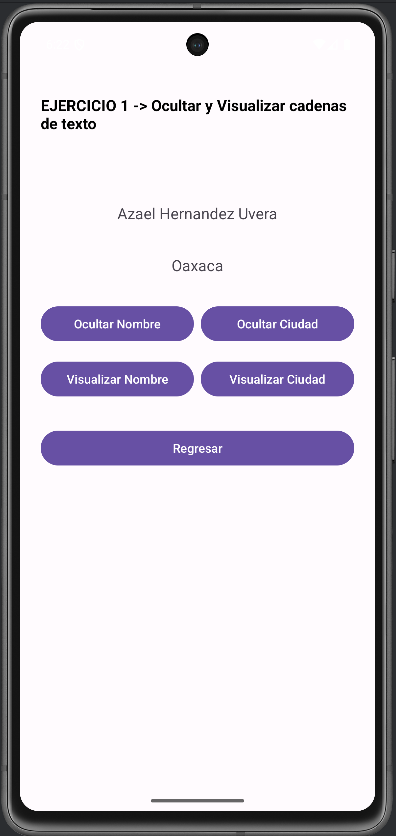

# Android-Skills-Portafolio
# 📱 Android Skills Portfolio

**Número de equipo:** 1  
**Integrantes:**  
- [Tu Nombre] – Desarrollador y Diseñador  

---

## 📌 ¿Qué hace la aplicación?

Esta aplicación móvil desarrollada en **Java con Android Studio** permite:  
- Iniciar sesión con validación de correo y contraseña.  
- Acceder a un **menú principal con 10 ejercicios prácticos**.  
- Navegar entre actividades para visualizar la solución de cada ejercicio.  
- Practicar y reforzar los conocimientos de la primera unidad del curso.  

**Tipo de sistema:** Proyecto Móvil (Java - Android Studio)  
**Librería externa implementada:** *Ninguna (solo librerías nativas de Android)*  

---

## 📝 Ejercicios Incluidos

Cada actividad corresponde a un ejercicio.  

### Ejercicio 1
**Descripción:**  
*(Breve explicación de lo que hace este ejercicio)*  

**Captura de pantalla:**  


---

### Ejercicio 2
**Descripción:**  
*(Breve explicación de lo que hace este ejercicio)*  

**Captura de pantalla:**  


---

### Ejercicio 3
**Descripción:**  
*(Breve explicación de lo que hace este ejercicio)*  

**Captura de pantalla:**  


---

### Ejercicio 4
**Descripción:**  
*(Breve explicación de lo que hace este ejercicio)*  

**Captura de pantalla:**  


---

### Ejercicio 5
**Descripción:**  
*(Breve explicación de lo que hace este ejercicio)*  

**Captura de pantalla:**  


---

### Ejercicio 6
**Descripción:**  
*(Breve explicación de lo que hace este ejercicio)*  

**Captura de pantalla:**  


---

### Ejercicio 7
**Descripción:**  
*(Breve explicación de lo que hace este ejercicio)*  

**Captura de pantalla:**  


---

### Ejercicio 8
**Descripción:**  
*(Breve explicación de lo que hace este ejercicio)*  

**Captura de pantalla:**  


---

### Ejercicio 9
**Descripción:**  
*(Breve explicación de lo que hace este ejercicio)*  

**Captura de pantalla:**  


---

### Ejercicio 10
**Descripción:**  
*(Breve explicación de lo que hace este ejercicio)*  

**Captura de pantalla:**  


---

## ⚙️ Requisitos Técnicos

- **Mínimo SDK:** API 24 (Android 7.0 Nougat)  
- **Versión recomendada:** Android 9.0 (Pie) o superior  
- **Lenguaje:** Java  
- **Entorno de desarrollo:** Android Studio  
- **Librerías externas:** Ninguna adicional (solo dependencias de Android estándar)  

**Buenas prácticas implementadas:**  
- Variables descriptivas  
- Comentarios breves en el código  
- Organización clara de actividades y layouts  

---

## 🚀 Pasos para instalar y ejecutar

1. Clonar este repositorio:  
   ```bash
   git clone https://github.com/tuusuario/AndroidSkillsPortafolio.git
