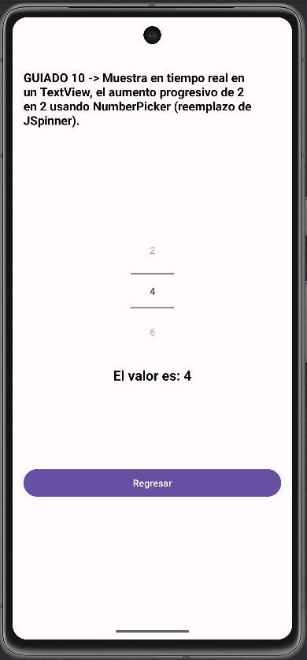
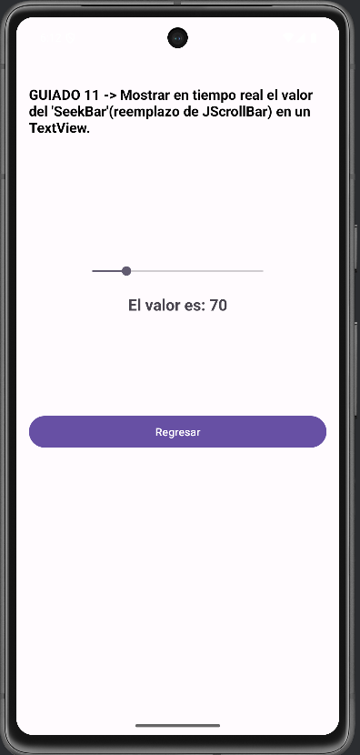
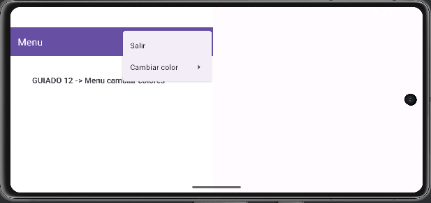
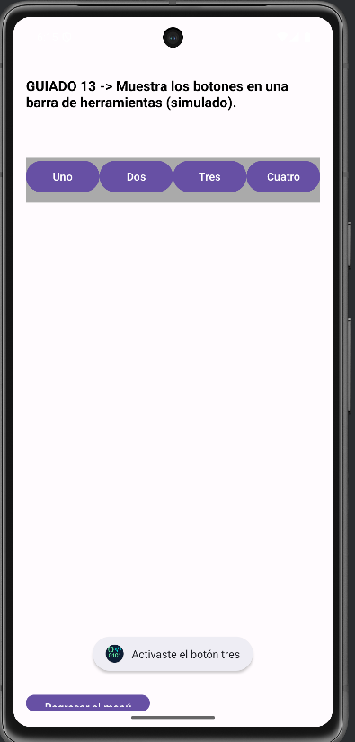
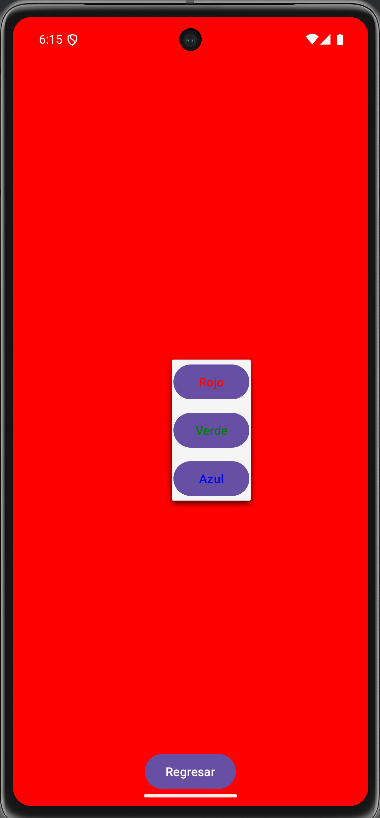
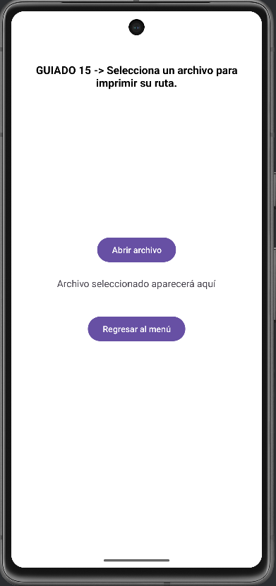

# Android-Skills-Portafolio
# 📱 Android Skills Portfolio

**Número de equipo:** 8 
---
**Integrantes:**  
- Azael Hernández Uvera - Desarrollador y diseñador
- Isai Raziel Toledo Mariscal - Desarrollador y tester
---

## 📌 ¿Qué hace la aplicación?

Esta aplicación móvil desarrollada en **Java con Android Studio** permite:  
- Iniciar sesión con validación de correo y contraseña.  
- Acceder a un **menú principal con 10 ejercicios prácticos**.  
- Navegar entre actividades para visualizar la solución de cada ejercicio.  
- Practicar y reforzar los conocimientos de la primera unidad del curso.  

**Tipo de sistema:** Proyecto Móvil (Java - Android Studio)  
**Librería externa implementada:** *Ninguna (solo librerías nativas de Android)*  

---

## 📝 Ejercicios Incluidos

Cada actividad corresponde a un ejercicio.  

### Ejercicio 3
**Descripción:**  
- Imprime la cadena de texto introducido al instante dentro de otro campo de texto.

**Captura de pantalla:**  


---

### Ejercicio 4
**Descripción:**  
Crea una oracion con los valores introducidos en los campos de texto cuando se pulsa un boton, tambien se toma en practica el poder habilitar y deshabilitar los campos de textos con diferentes botones.

**Captura de pantalla:**  


---

### Ejercicio 5
**Descripción:**  
- Consiste en calcular el valor del IVA agregado a nuestros productos.

**Captura de pantalla:**  


---

### Ejercicio 6
**Descripción:**  
- Consiste en calcular el promedio de 3 trimestres, el resultado dependera en si la calificacion final dad es aprobatorio o reprobatoria.

**Captura de pantalla:**  


---

### Ejercicio 7
**Descripción:**  
- Consiste en calcular el Area junto al Perimetro de un circulo introduciendo unicamente el radio del dicho mencionado.

**Captura de pantalla:**  


---

### Ejercicio 8
**Descripción:**  
- Consiste en dar el resultado de potencias, introduciendo los valores de la potencia y de la base.

**Captura de pantalla:**  


---


### Guiado 10
**Descripción:**  
- Mostramos los valores en tiempo real en un TextView de los aumentos progresivos pares usando un NumberPicker.

**Captura de pantalla:**  


---

### Guiado 11
**Descripción:**  
- Mostramos los valores en tiempo real el valor dado por un SeekBar dentro de un TextView.

**Captura de pantalla:**  


---

### Guiado 12
**Descripción:**  
- Hacemos uso de un menu para interacturar con el usuario, en dicho menu se puede cambiar el color de la pantalla, estando los siguientes disponibles : rojo, azul, verde.

**Captura de pantalla:**  


---

### Guiado 13
**Descripción:**  
- Hacemos uso de un layout para simular una barra de herramientas en donde, dentro de ella colocamos botones que arrojan un mensaje segun el boton presionado.

**Captura de pantalla:**  


---

### Guiado 14 
**Descripción:**  
- Mostramos un menu segun el lugar donde el usuario haga presion en la pantalla, dicho menu muestra los colores que al seleccionar uno, cambia el color de la pantalla.

**Captura de pantalla:**  


---

### Guiado 15
**Descripción:**  
- Permite elegir un archivo dentro del almacenamiento del usuario, despues de haber seleccionado un archivo, se abrira el nombre y ruta del archivo escogido.

**Captura de pantalla:**  


---


## ⚙️ Requisitos Técnicos

- **Mínimo SDK:** API 24 (Android 7.0 Nougat)  
- **Versión recomendada:** Android 9.0 (Pie) o superior  
- **Lenguaje:** Java  
- **Entorno de desarrollo:** Android Studio  
- **Librerías externas:** Ninguna adicional (solo dependencias de Android estándar)  

**Buenas prácticas implementadas:**  
- Variables descriptivas  
- Comentarios breves en el código  
- Organización clara de actividades y layouts  

---

## 🚀 Pasos para instalar y ejecutar

1. Clonar este repositorio:  
   ```bash
   git clone https://github.com/tuusuario/AndroidSkillsPortafolio.git
